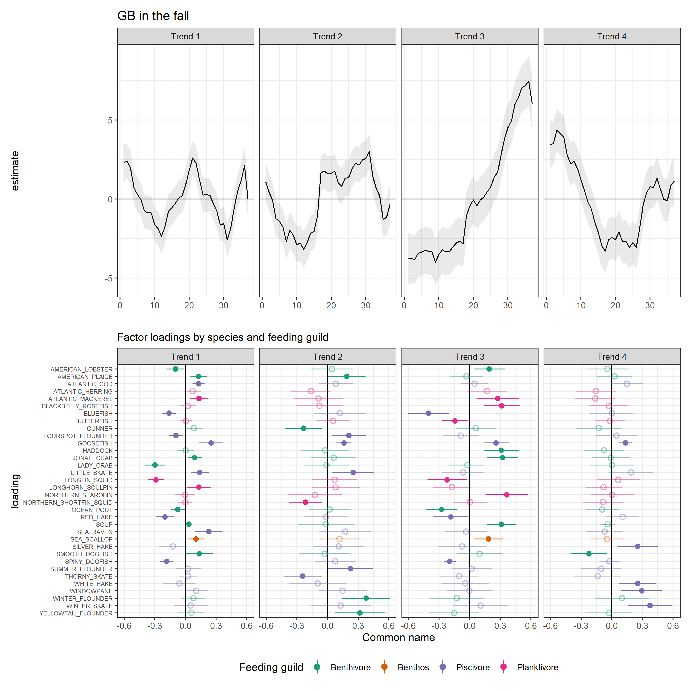
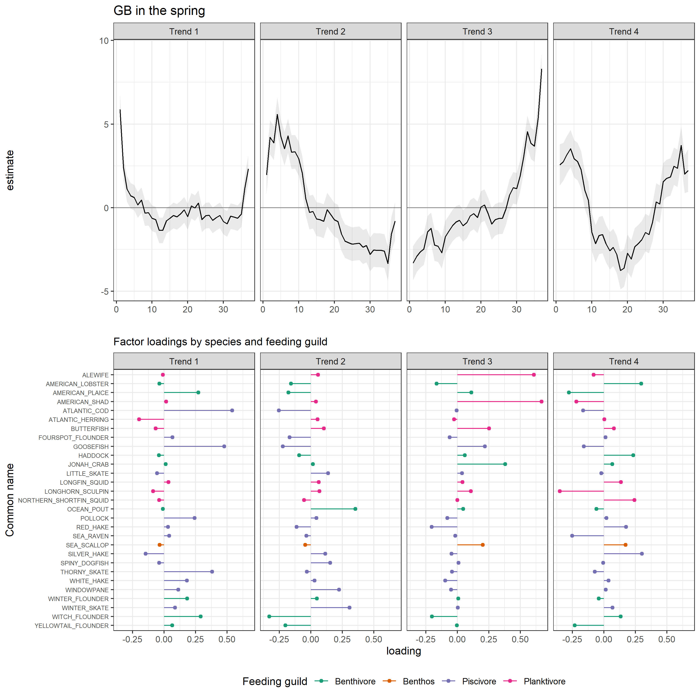
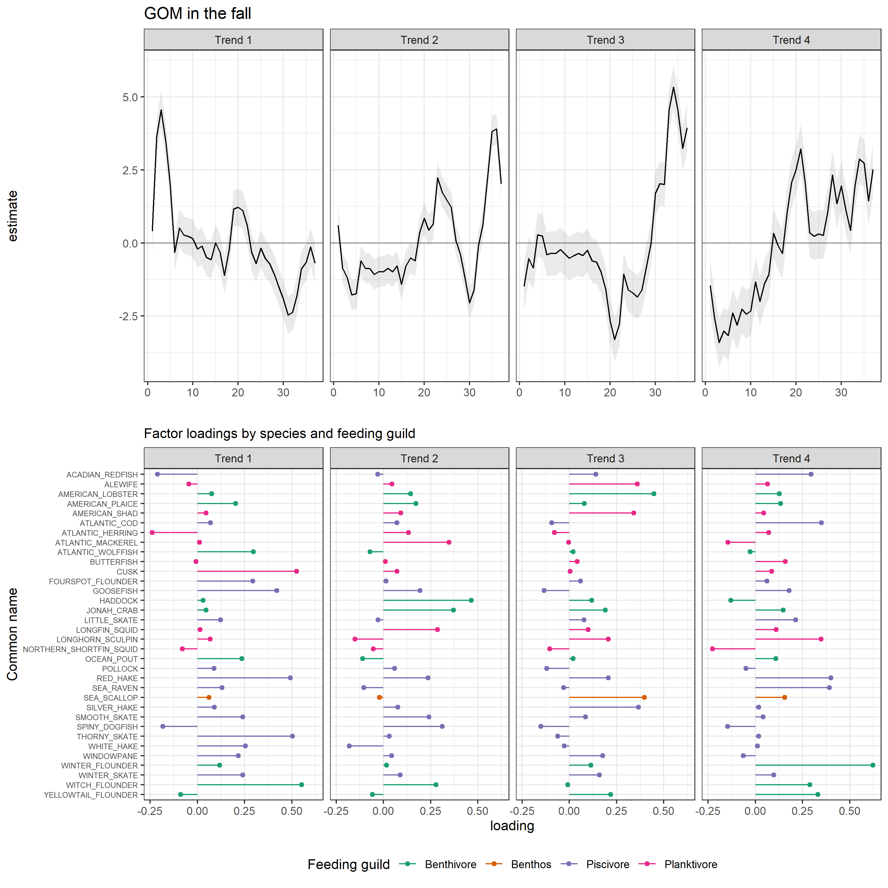
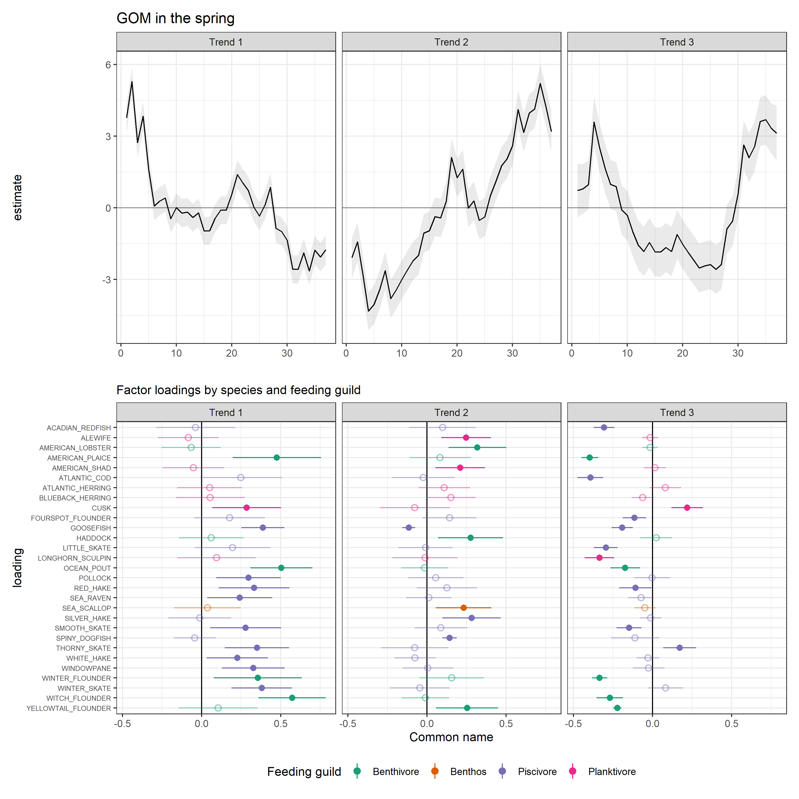
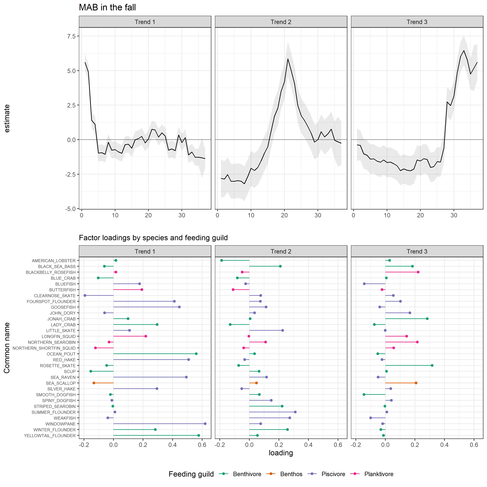
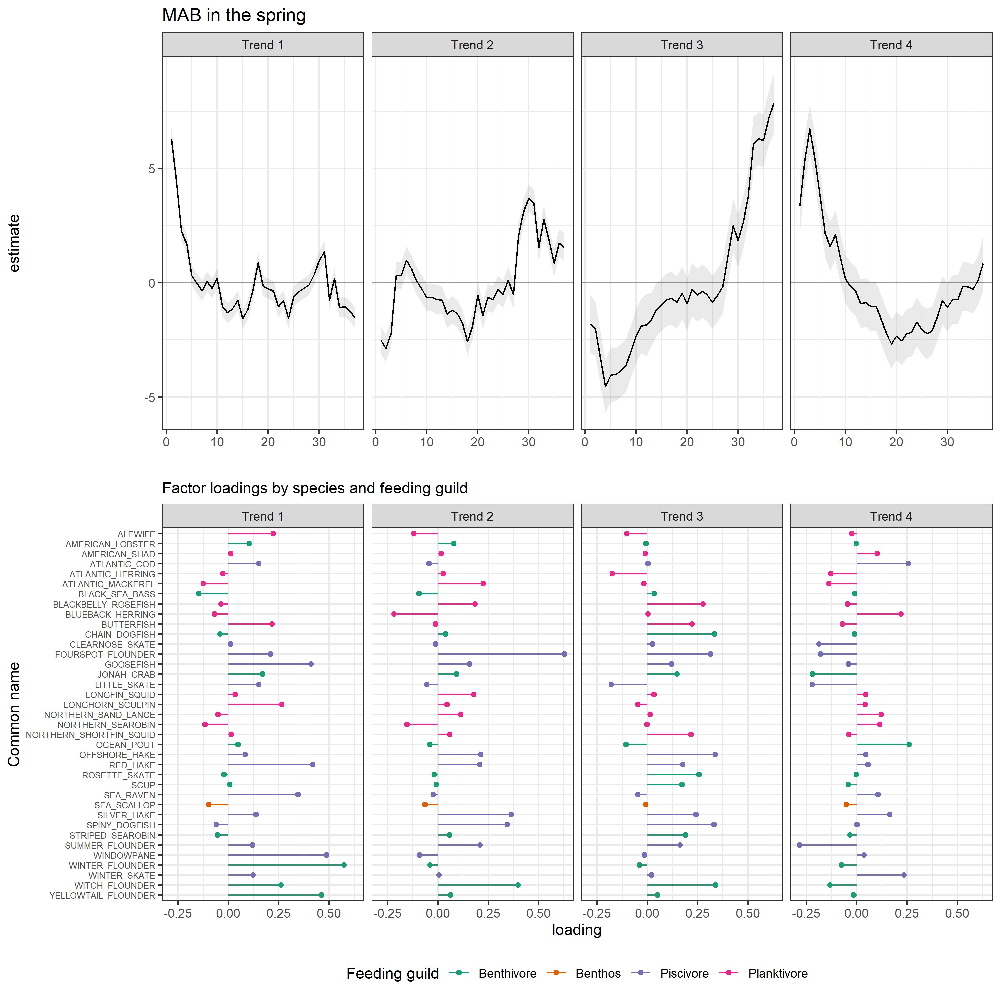

Dynamic Factor Analysis
================
Scott Large
7/21/2020

## Introduction

1.  EBFM and IEA yadda yadda yadda
2.  The need for synthesis in IEAs
      - Improving story-telling with indexes
      - Creating hypotheses for causal relationships
      - Move from “so-what” towards opperational EBFM/EAFM
3.  The State of the Ecosystem Report (SOE) has many indicators but
    explaining teleconnections and “bigger picture” messages remains a
    challenge.
4.  Here, we seek to reduce the dimensionality of data to:
      - identify common trends between indicators to serve as an
        ecosystem index
      - identify covariates that improve explanatory power of common
        trends
      - ?
5.  DFAs identify latent trends in time-series using some fancy-pants
    maths.
      - We are tracking stability using feeding guilds.
          - If we use raw species kg/tow survey data to identify common
            trends between species, these might provide
            additional/better/other insight into ecosystem stability.
          - Covariates can also be included to identify hypotheses that
            might be useful for improved management  
          - *n.b. VAST can do spatial DFA, so this could all be done
            within a single framework – I don’t know how or if it would
            require unreasonable computing resources*
      - Potential covariate data: environmental (e.g., SST, BT, and
        chla) and socio-economic (e.g., revenue, engagement, landings,
        etc)

## Materials and Methods

# Data

1.  Survey data
      - For each ecoregion, select the *n* species that occur in *x*
        tows and aggregate to annual/seasonal
      - *VAST, we would just need to filter for subset of species and
        not worry about aggregating to annual/seasonal values.*
2.  Environmental data
      - For each ecoregion: Seasonal bottom temperature,
      - Basin-wide: NAO, AMO, …?
      - *VAST could use interpolated station data from Kevin*

# Modeling

We used
[MARSS](https://cran.r-project.org/web/packages/MARSS/index.html) DFA as
a dimension reduction tool.

## Results


<div class="figure" style="text-align: center">



<p class="caption">

DFA trends and factor loadings by species and feeding guild for each EPU
and season.

</p>

</div>

<div class="figure" style="text-align: center">



<p class="caption">

DFA trends and factor loadings by species and feeding guild for each EPU
and season.

</p>

</div>

<div class="figure" style="text-align: center">



<p class="caption">

DFA trends and factor loadings by species and feeding guild for each EPU
and season.

</p>

</div>

<div class="figure" style="text-align: center">



<p class="caption">

DFA trends and factor loadings by species and feeding guild for each EPU
and season.

</p>

</div>

<div class="figure" style="text-align: center">



<p class="caption">

DFA trends and factor loadings by species and feeding guild for each EPU
and season.

</p>

</div>

<div class="figure" style="text-align: center">



<p class="caption">

DFA trends and factor loadings by species and feeding guild for each EPU
and season.

</p>

</div>


<!-- ```{r} -->

<!-- ## Grab the best models and get all the relevant info from the MARSSobj -->

<!-- ci_mod <- mod_dat %>% -->

<!--   filter(!is.na(best_model)) %>% -->

<!--   head(1) %>%  -->

<!--   group_by(EPU, Season) %>% -->

<!--   mutate(dat = purrr::map(file_path, ~readRDS(.x)), -->

<!--          sp_dat = purrr::map(dat, c("call", "data")),  -->

<!--          comname = purrr::map(sp_dat, ~rownames(.x)), ## Get the imput rows -->

<!--          trends = map(dat, tidy, type = "xtT"), ## Output trends -->

<!--          dat_ci = purrr::map(dat, ~MARSSparamCIs(.x, method = "hessian", alpha = 0.05, -->

<!--                                                         nboot = 5000, silent = FALSE)), -->

<!--          z_est = map(dat_ci, matrix_ci, var = "raw"), -->

<!--          z_est_up = map(dat_ci, matrix_ci, var = "up"), -->

<!--          z_est_lo = map(dat_ci, matrix_ci, var = "lo"), -->

<!--          h_inv = map(z_est, ~varimax(.x)$rotmat), -->

<!--          h_inv_lo = map(z_est_lo, ~varimax(.x)$rotmat), -->

<!--          h_inv_up = map(z_est_up, ~varimax(.x)$rotmat), -->

<!--          z_rot = map2(.x = z_est, .y = h_inv, ~ data.frame(.x %*% .y)), ## Loadings -->

<!--          z_rot_lo = map2(.x = z_est_lo, .y = h_inv_lo, ~ data.frame(.x %*% .y)), ## Loadings -->

<!--          z_rot_up = map2(.x = z_est_up, .y = h_inv_up, ~ data.frame(.x %*% .y)), ## Loadings -->

<!--          fits = purrr::map(dat, get_dfa_fits)) %>%  ## and model fits -->

<!--   select(-sp_dat, -z_est, -z_est_lo, -z_est_up, -h_inv, -h_inv_lo, -h_inv_up, -dat, dat_ci) ## remove extra and big files -->

<!-- tm <- mod_dat %>% -->

<!--   filter(!is.na(best_model)) %>% -->

<!--   head(1) %>%  -->

<!--   mutate(dat = purrr::map(file_path, ~readRDS(.x)), -->

<!--          dat_ci = purrr::map(dat, ~MARSSparamCIs(.x, method = "hessian", alpha = 0.05,  -->

<!--                                                  silent = FALSE)), -->

<!--          sp_dat = purrr::map(dat, c("call", "data")),  -->

<!--          comname = purrr::map(sp_dat, ~rownames(.x)), -->

<!--          z_rot = map(dat_ci, rotate_z, var = "raw"), -->

<!--          z_rot_low =  map(dat_ci, rotate_z, var = "low"), ## Loadings -->

<!--          z_rot_up =  map(dat_ci, rotate_z, var = "up")) %>%  ## Loadings -->

<!--   select(-dat, dat_ci) -->

<!-- td <- mod_dat %>% -->

<!--   filter(!is.na(best_model)) %>% -->

<!--   head(1) %>%  -->

<!--   mutate(dat = purrr::map(file_path, ~readRDS(.x))) -->

<!-- dfa_temp <- MARSSparamCIs(tm$dat_ci[[1]]) -->

<!-- MLEobj <- dfa_temp -->

<!-- # Get the Z, upZ, lowZ -->

<!-- Z <- coef(dfa_temp, type = "matrix")$Z -->

<!-- tmp <- dfa_temp; tmp$par <- tmp$par.upCI -->

<!-- Z.up <- MARSS:::parmat(tmp)$Z -->

<!-- tmp <- dfa_temp; tmp$par <- tmp$par.lowCI -->

<!-- Z.low <- MARSS:::parmat(tmp)$Z -->

<!-- Z.rot <- data.frame(var = "raw", Z %*% H.inv) -->

<!-- Z.rot.up <-  data.frame(var = "up", Z.up %*% H.inv) -->

<!-- Z.rot.low <-  data.frame(var = "lo", Z.low %*% H.inv) -->

<!-- df <- bind_rows(Z.rot, Z.rot.up, Z.rot.low) -->

<!-- colnames(df)[2:5] <- c("trend_1", "trend_2", "trend_3", "trend_4") -->

<!-- df$comname <- rep(td$comname[[1]], 3) -->

<!-- loads_long <- pivot_longer(df, cols = c("trend_1", "trend_2", "trend_3", "trend_4"), -->

<!--                                   names_to = "trend", values_to = "val") -->

<!-- loads_dat <- pivot_wider(loads_long, names_from = var, values_from = val) %>%  -->

<!--   mutate(with_zero = case_when(var == "lo" & val < 0 ~ "yes", -->

<!--                                var == "up" & val > 0 ~ "yes", -->

<!--                                TRUE ~ "no")) -->

<!-- load_dat <- td %>%  -->

<!--   select(EPU, Season, comname, z_rot, z_rot_low, z_rot_up) %>% -->

<!--   unnest(c(comname, z_rot, z_rot_low, z_rot_up), names_sep = ".") %>%  -->

<!--   ungroup() %>%  -->

<!--   pivot_longer(-c(EPU, Season, comname.comname), names_to = "trend", values_to = "val") %>% -->

<!--   rename(comname = comname.comname) %>%  -->

<!--   left_join(sp_guild, by = c("EPU", "Season", "comname")) %>% -->

<!--   separate(col = trend, into = c("var", "trend"), sep = "\\.") %>%  -->

<!--   mutate(trend = gsub("X", "Trend ", trend)) %>%  -->

<!--   na.omit(val) %>%  -->

<!--   pivot_wider(id_cols = c(EPU, Season, comname, trend, feeding_guild), names_from = var, values_from = val) %>%  -->

<!--   mutate(diff_zero = case_when(z_rot_low < 0 & z_rot_up > 0 ~ "no-sig", ## lower less than zero, upper greater than zero -->

<!--                                z_rot_low < 0 & z_rot_up < 0 ~ "sig", ## lower less than zero, upper less than zero -->

<!--                                z_rot_low > 0 & z_rot_up > 0 ~ "sig", ## lower greater than zero, upper greater than zero -->

<!--                                z_rot_low > 0 & z_rot_up < 0 ~ "no-sig", ## lower greater than zero, upper less than zero -- weird... -->

<!--                                TRUE ~ NA_character_)) -->

<!-- ggplot(data = load_dat,  -->

<!--        aes(x = comname,  -->

<!--            # xend = 0, -->

<!--            ymin = z_rot_low, -->

<!--            ymax = z_rot_up, -->

<!--            shape = diff_zero, -->

<!--            # yend = as.factor(comname),  -->

<!--            alpha = diff_zero, -->

<!--            y = z_rot,  -->

<!--            color = feeding_guild)) + -->

<!--   geom_hline(yintercept = 0, color = "black") + -->

<!--   geom_pointrange() + -->

<!--   # geom_segment() + -->

<!--   coord_flip() + -->

<!--   facet_grid( ~ trend) + -->

<!--   scale_color_brewer(palette = "Dark2") + -->

<!--   scale_shape_manual(values = c(21, 16), guide = FALSE) +  -->

<!--   scale_alpha_manual(values = c(.45, 1), guide = FALSE) +  -->

<!--   # guides(shape = FALSE) + -->

<!--   # scale_x_discrete(limits = rev(levels(as.factor(load_dat$comname)))) + -->

<!--   labs(subtitle = "Factor loadings by species and feeding guild", -->

<!--        y = "Common name", -->

<!--        x = "loading", -->

<!--        shape = "", -->

<!--        color = "Feeding guild") + -->

<!--   theme_bw() + -->

<!--   theme(axis.text.y = element_text(size = rel(.7)), -->

<!--         legend.position = "bottom") + -->

<!--   NULL -->

<!-- ``` -->

## Discussion

What’s next: \*
