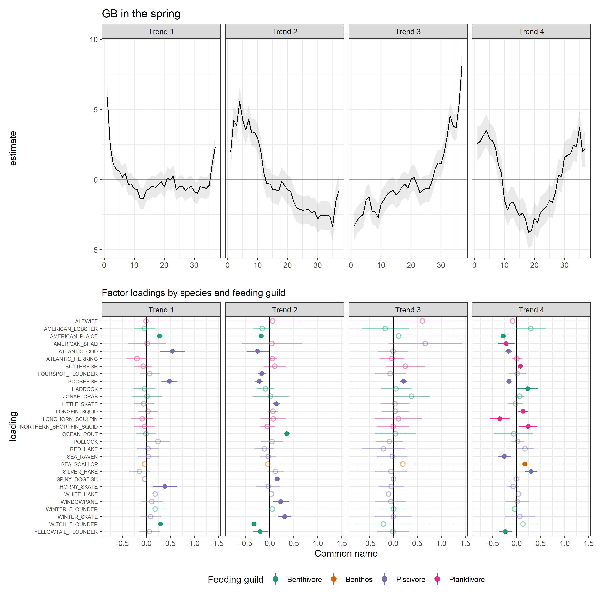
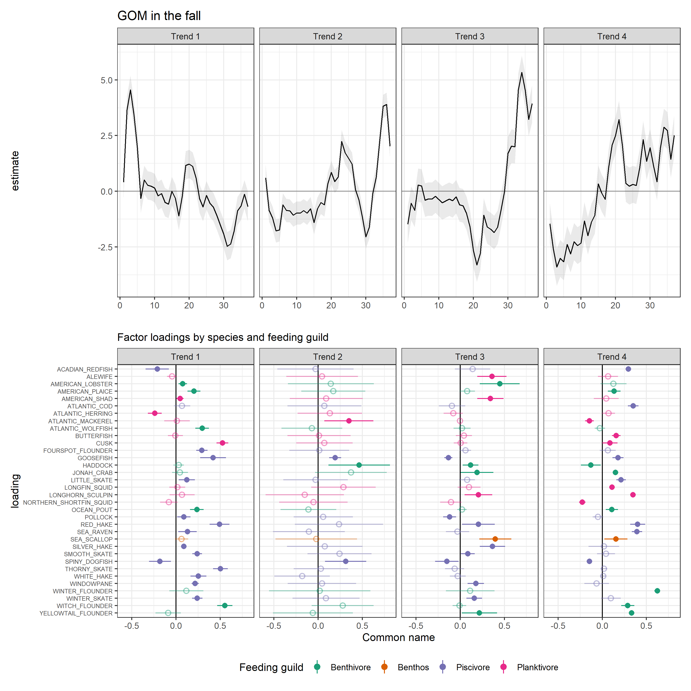
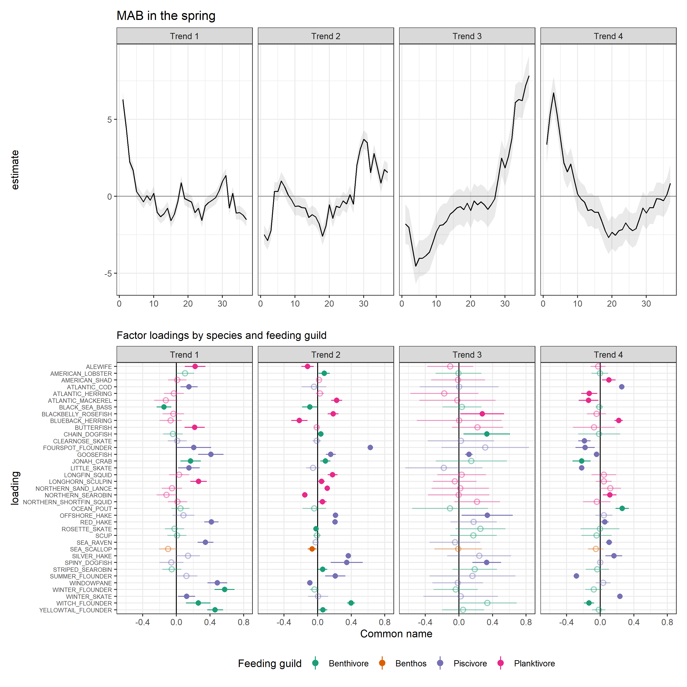

Dynamic Factor Analysis
================
Scott Large
7/21/2020

## Introduction

1.  EBFM and IEA yadda yadda yadda
2.  The need for synthesis in IEAs
      - Improving story-telling with indexes
      - Creating hypotheses for causal relationships
      - Move from “so-what” towards opperational EBFM/EAFM
3.  The State of the Ecosystem Report (SOE) has many indicators but
    explaining teleconnections and “bigger picture” messages remains a
    challenge.
4.  Here, we seek to reduce the dimensionality of data to:
      - identify common trends between indicators to serve as an
        ecosystem index
      - identify covariates that improve explanatory power of common
        trends
      - ?
5.  DFAs identify latent trends in time-series using some fancy-pants
    maths.
      - We are tracking stability using feeding guilds.
          - If we use raw species kg/tow survey data to identify common
            trends between species, these might provide
            additional/better/other insight into ecosystem stability.
          - Covariates can also be included to identify hypotheses that
            might be useful for improved management  
          - *n.b. VAST can do spatial DFA, so this could all be done
            within a single framework – I don’t know how or if it would
            require unreasonable computing resources*
      - Potential covariate data: environmental (e.g., SST, BT, and
        chla) and socio-economic (e.g., revenue, engagement, landings,
        etc)

## Materials and Methods

# Data

1.  Survey data
      - For each ecoregion, select the *n* species that occur in *x*
        tows and aggregate to annual/seasonal
      - *VAST, we would just need to filter for subset of species and
        not worry about aggregating to annual/seasonal values.*
2.  Environmental data
      - For each ecoregion: Seasonal bottom temperature,
      - Basin-wide: NAO, AMO, …?
      - *VAST could use interpolated station data from Kevin*

# Modeling

We used
[MARSS](https://cran.r-project.org/web/packages/MARSS/index.html) DFA as
a dimension reduction tool.

## Results


<!-- ```{r loadings-plot, eval=TRUE, fig.align='center', fig.cap="Factor loadings by species and feeding guild.\\label{fig:loadings-plot}"} -->

<!-- load_dat <- best_mod %>%  -->

<!--   select(EPU, Season, comname, z_rot) %>%  -->

<!--   unnest(c(comname, z_rot)) %>%  -->

<!--   ungroup() %>%  -->

<!--   pivot_longer(-c(EPU, Season, comname), names_to = "trend", values_to = "val") %>% -->

<!--   left_join(sp_guild, by = c("EPU", "Season", "comname")) %>% -->

<!--   mutate(trend = gsub("X", "Trend ", trend)) %>%  -->

<!--   na.omit(val) -->

<!-- # load_plot <- ggplot(data = load_dat, aes(y = comname, xend = 0, yend = comname, x = val, color = feeding_guild)) + -->

<!-- #   geom_point() + -->

<!-- #   geom_segment()+ -->

<!-- #   facet_grid(EPU + Season ~ trend) + -->

<!-- #   scale_color_brewer(palette = "Dark2") + -->

<!-- #   # scale_y_discrete(limits = rev(levels(as.factor(load_dat$comname)))) + -->

<!-- #   labs(title = "DFA factor loadings", -->

<!-- #        subtitle = sprintf("Factor loadings by species and feeding guild"), -->

<!-- #        y = "Common name", -->

<!-- #        x = "loading", -->

<!-- #        color = "Feeding guild") + -->

<!-- #   theme_bw() + -->

<!-- #   theme(axis.text.y = element_text(size = rel(.6)), -->

<!-- #         legend.position = "bottom") + -->

<!-- #   NULL -->

<!-- # load_plot -->

<!-- ``` -->




## Discussion

What’s next: \*
